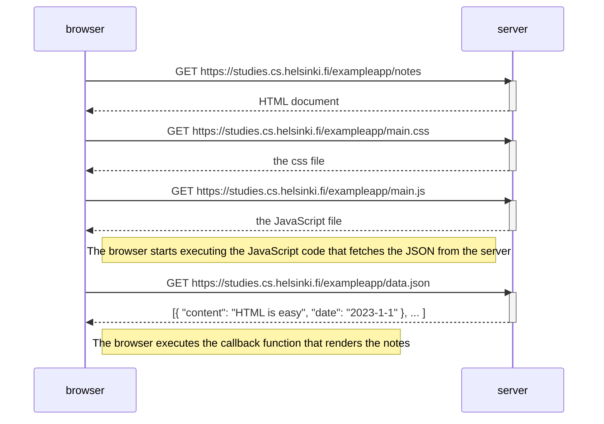
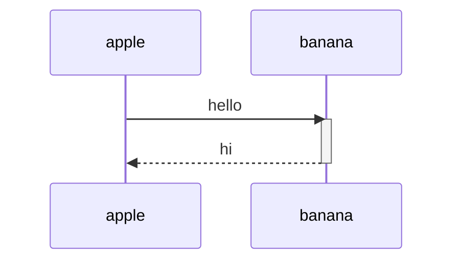

<!--
 * @Author: Frank Chu
 * @Date: 2023-01-21 00:38:13
 * @LastEditors: Frank Chu
 * @LastEditTime: 2023-01-26 18:40:56
 * @FilePath: /fullstackopen/README.md
 * @Description: 
 * 
 * Copyright (c) 2023 by Frank Chu, All Rights Reserved. 
-->
# fullstackopen.com by Helsinki University

