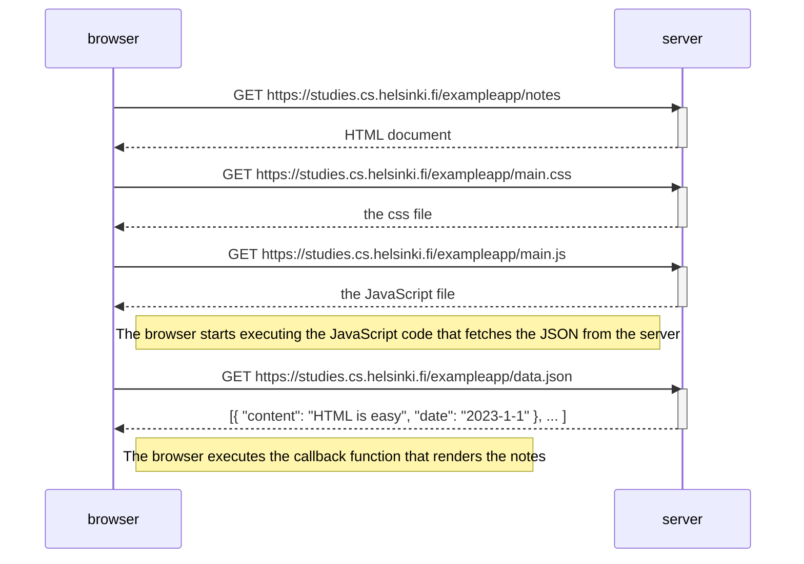
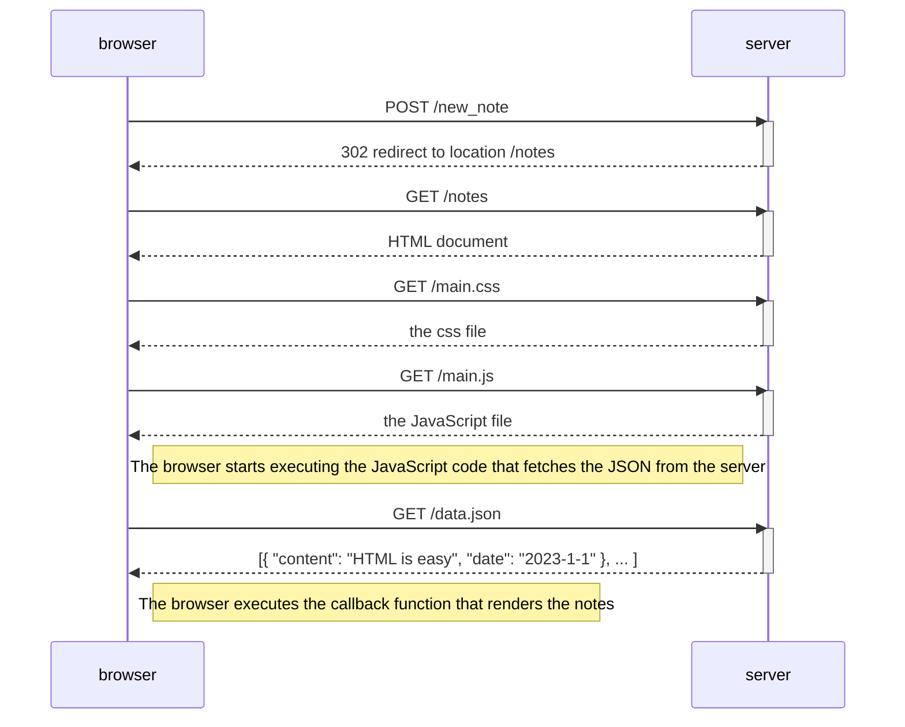
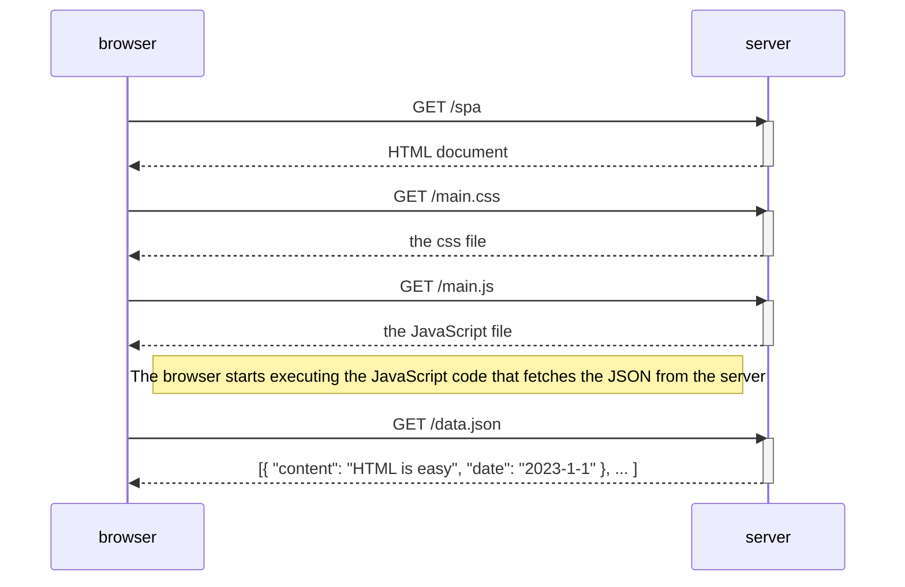
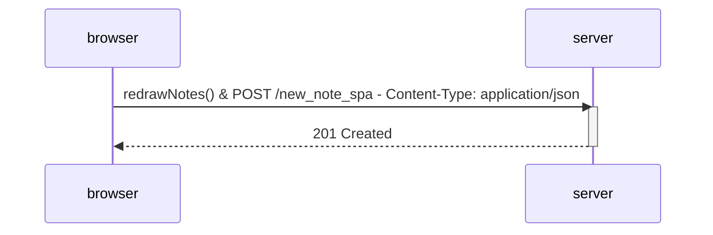

<!--
 * @Author: Frank Chu
 * @Date: 2023-01-22 23:48:27
 * @LastEditors: Frank Chu
 * @LastEditTime: 2023-01-23 10:50:53
 * @FilePath: /fullstackopen/part0/beginner-html-site/README.md
 * @Description: 
 * 
 * Copyright (c) 2023 by Frank Chu, All Rights Reserved. 
-->
# beginner-html-site

## Example - Loading a page containing JavaScript - review

## 0.4: New note diagram

depicting the situation where the user creates a new note on the page https://studies.cs.helsinki.fi/exampleapp/notes by writing something into the text field and clicking the submit button.

## 0.5: Single page app diagram

Create a diagram depicting the situation where the user goes to the single-page app version of the notes app at https://studies.cs.helsinki.fi/exampleapp/spa.

## 0.6: New note in Single page app diagram

Create a diagram depicting the situation where the user creates a new note using the single-page version of the app.

